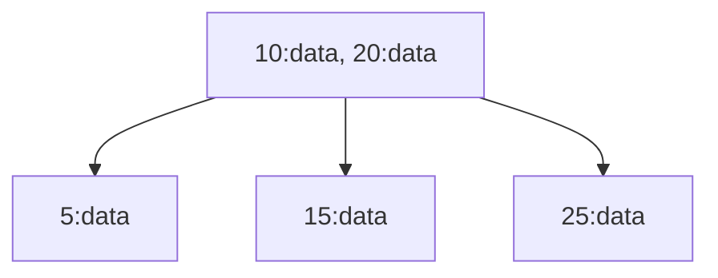
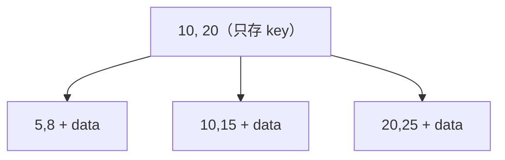

# B Tree

> 通用概念。MySQL（InnoDB）、PostgreSQL、SQL Server、SQLite 都用 B+ Tree 做 index。

DB 裡幾乎所有 index 都是 B+ Tree。查一筆資料只需要 3–4 次磁碟 IO，不管表裡有一萬筆還是一億筆。

## Binary Search Tree 在磁碟上的問題

BST（Binary Search Tree）每個 node 存一筆 entry（key + value），左邊的 key 比自己小，右邊比自己大。查詢時從 root 往下走，每層排除一半，O(log₂N)。

```text
BST：每個 node 一筆 entry
        8:data
       /     \
     3:data  10:data
     /  \       \
  1:data 6:data 14:data
```

問題一：如果按順序插入 1, 2, 3, 4, 5，BST 會歪成一條直線，退化成 O(n)。**AVL Tree** 和 **Red-Black Tree** 解決這個問題：自平衡的 BST，插入後自動旋轉調整，保證不會歪掉。

問題二：即使平衡了，**每個 node 還是只有一筆 entry**。一億筆資料，樹高 log₂(一億) ≈ 27 層。在記憶體裡 27 層沒問題，但 DB 的 index 存在磁碟上，每層要一次磁碟 IO。磁碟一次 seek 約 10ms，27 次就是 270ms。太慢了。

## B+ Tree：一個 node 塞幾百筆 entry

B+ Tree 的每個 node 對應一整個 page（通常 16KB），一個 page 能塞幾百筆 entry。

B+ Tree 的 node 分兩種：

```text
Internal page（內部節點）→ 只存 key，用來導航「往左走還是往右走」
Leaf page（葉節點）     → 存 key + data，真正的資料在這裡

            [50, 100]              ← Internal page：只有 key
           /    |     \
[1..49 的 rows] [50..99] [100..150]  ← Leaf page：key + 完整的 row 資料
```

BST 的每個 node 對應的是 leaf page 裡的**一筆 entry**，而非一整個 page。一個 leaf page 裡有幾十到幾百筆 row。

```text
BST：一個 node 一筆 entry → 一億筆，27 層，27 次磁碟 IO
B+ Tree：一個 node 幾百筆 entry → 一億筆，3-4 層，3-4 次磁碟 IO
```

從 27 次降到 3-4 次，這就是 DB 用 B+ Tree 而不用 AVL / RBTree 的原因。AVL 和 RBTree 適合記憶體內的資料結構，B+ Tree 適合磁碟上的 index。

## 為什麼是 3-4 層：空間感換算

「一億筆 3-4 次 IO」是這樣算出來的：

1. **Page size = 16 KB**（每個 node 就是一個 page）
2. **Internal node 每個 entry ≈ 14 bytes**（key 8B + pointer 6B）→ 一個 page 塞 ~1000 個 entry → **fan-out ≈ 1000**
3. **Leaf page 每筆 row ≈ 100~200 bytes** → 一片 leaf 塞 ~100 筆 row

internal 和 leaf 的角色**完全不同**：

- **Internal page** 只存「往哪走」的導航資訊（key + pointer），entry 很小，fan-out 大
- **Leaf page** 存整筆 row 資料，entry 大很多，一片裝 ~100 筆就停了

「往下展開 1000」這件事只發生在 internal 層。Leaf 是終點，不再展開。

```text
Level 0 (root):                  1 page
                                  ↓ 展開 1000
Level 1 (internal):          1,000 pages
                                  ↓ 每個展開 1000
Level 2 (internal):      1,000,000 pages
                                  ↓ 每個展開 1000
Level 3 (leaf):      1,000,000,000 pages
                                  ↓ 每片 leaf 100 筆 row
Total:              100,000,000,000 rows (1000 億)
```

容量公式：`N ≈ 1000^(internal層數) × 100`

| 樹深（含 leaf） | 容量 |
|---|---|
| 2 層 | 10 萬 |
| 3 層 | 1 億 |
| 4 層 | 1000 億 |

一億筆只要 3 層，一千億筆才需要 4 層。「幾億筆 3-4 次 IO」已經是寬裕的估計。

### 對比 BST：差在對數的底數

```text
BST (fan-out 2):   log₂(1億)    ≈ 27 層 → 27 次磁碟 IO
B+ Tree (1000):    log₁₀₀₀(1億) ≈  3 層 →  3 次磁碟 IO
```

磁碟一次 seek 約 10ms。27 次 = 270ms，3 次 = 30ms。fan-out 從 2 拉到 1000，層數就少了 9 倍，這就是 B+ Tree 比 BST 家族好用的根本原因。Fan-out 能做這麼大，靠的是 internal node 只存 key 不存 data，entry 夠小才塞得下 1000 個。

### 胖 row 的影響

一筆 row 很大（例如 2KB）會發生什麼？

- Leaf 每片塞得下的 row 從 100 筆掉到 8 筆（16KB / 2KB）
- Internal node 的 fan-out 不受影響（internal 只存 key）

```text
Depth 4: 1 → 1000 → 1M → 1B leaf × 8 rows ≈ 80 億筆
```

容量變成原本的 1/12，但「3-4 層涵蓋幾十億筆」的結論還是成立。設計表時把 TEXT / BLOB 存到別的地方、主表只放指標，就是為了讓 leaf 小一點、樹矮一點、IO 少一點。

## B Tree vs B+ Tree

B Tree 的每個 node 都存 key + data。B+ Tree 只在 leaf node 存 data，internal node 只存 key。

**B Tree**：每個 node 都存 key + data。



**B+ Tree**：internal node 只存 key，data 全部在 leaf。Leaf 之間用指標串成 linked list，支援 range query。



B+ Tree 的好處：internal node 不存 data，一個 page 能塞更多 key，樹更矮，IO 更少。Leaf node 之間有指標串連，range query（`WHERE id BETWEEN 10 AND 50`）沿著 linked list 掃就好，不用回 root。

所有主流 RDBMS（MySQL InnoDB、PostgreSQL、SQL Server）用的都是 B+ Tree。口語上說「B-Tree index」其實指的是 B+ Tree。

## 寫入：page split

INSERT 一筆資料，沿著 B+ Tree 找到對應的 leaf page，塞進去。如果 leaf page 滿了，就拆成兩個 page（page split），parent node 多一個 key 指向新 page。

page split 的代價：一次寫可能變成多次寫（leaf 一次 + parent 一次，若 parent 也滿還會往上連鎖）。Random write 也難以避免，INSERT 到中間的 leaf 需要 random IO，這點對 UUID PK 特別致命（見 [clustered-index](chunk://clustered-index)）。

---

B+ Tree 把 index 攤在磁碟上，讀取只要 3-4 次 IO。代價是寫入要維護 B+ Tree 的排序結構，隨機寫入和 page split 都是成本。

想看反向的取捨（為了寫入快而犧牲讀取），看 [lsm-tree](chunk://lsm-tree)。
