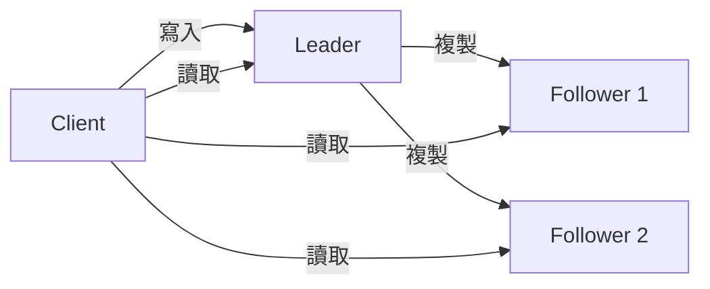
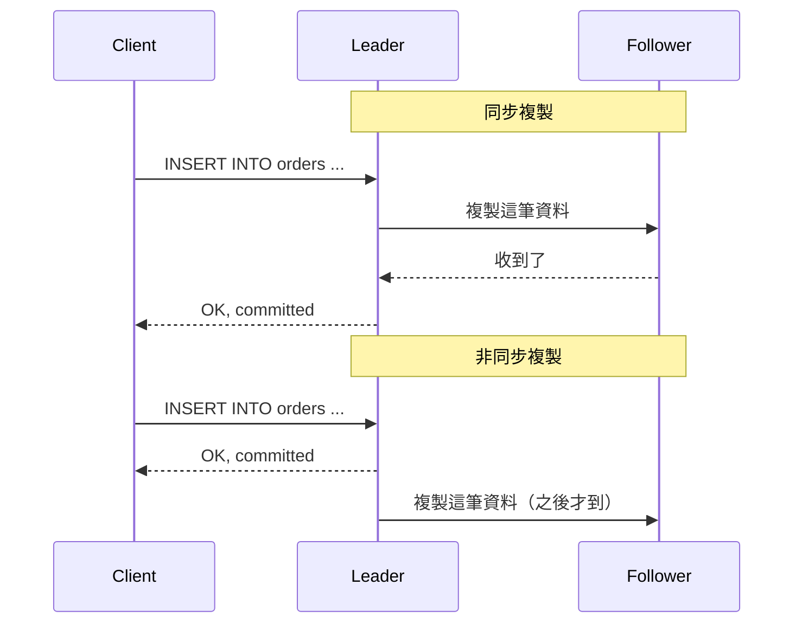
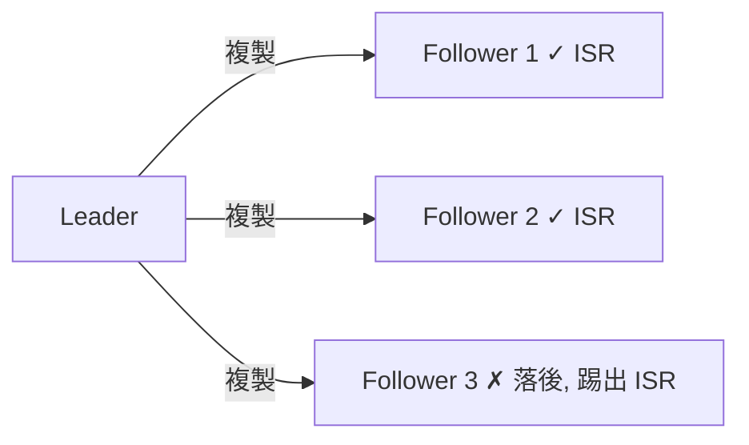

# Replication

> 通用概念。MySQL、PostgreSQL、MongoDB、Kafka 都有 replication。Leader-follower 架構是通用的，ISR 機制是 Kafka 特有的。

同一份資料複製到多個節點。一個掛了，其他的還能服務。

## Leader-Follower

最常見的架構。一個 leader（也叫 primary / master）負責所有寫入。Follower（也叫 replica / slave）從 leader 複製資料，只接受讀取。Kafka 也是這個形狀：每個 partition 一個 leader，其餘 broker 當 follower。

Leader 掛了怎麼辦？Follower 之間投票選出新 leader（failover）。選舉期間無法寫入。

## 同步 vs 非同步複製

**同步**：leader 等 follower 確認收到才回覆 client。資料不會丟，但慢。一個 follower 卡住，整個寫入就卡住。

**非同步**：leader 寫完馬上回覆 client，follower 之後追。快，但 leader 掛了可能丟最近的寫入（follower 還沒收到）。

## Kafka 的 ISR（In-Sync Replicas）

ISR 是折衷方案：不等所有 follower，只等「跟得上的」。

每個 partition 有一個 leader 和多個 follower。ISR 是「目前跟得上 leader」的 follower 清單。Kafka 用 `replica.lag.time.max.ms`（預設 30 秒）判斷：如果一個 follower 超過 30 秒沒向 leader 拉取資料，就被踢出 ISR。

被踢出的 follower 不會被刪除。它繼續嘗試從 leader 拉資料追進度。一旦追上（lag 回到門檻內），自動回到 ISR。

Producer 寫入時用 `acks` 參數控制等誰：

| acks | 行為 | 取捨 |
|---|---|---|
| `0` | 不等任何人 | 最快，可能丟 |
| `1` | 只等 leader 寫入 | leader 掛了可能丟 |
| `all` | 等所有 ISR 成員確認 | 最安全，最慢 |

`acks=all` 配合 `min.insync.replicas=2`：至少要有 2 個 ISR 成員才接受寫入。如果 ISR 只剩 leader 自己，拒絕寫入（犧牲可用性保資料）。

---

replication 要選同步還是非同步。同步保證一致但慢，非同步快卻可能掉資料。Kafka 的 ISR 是中間解：非同步複製，但用 `acks` 讓 producer 自己選要等誰。
